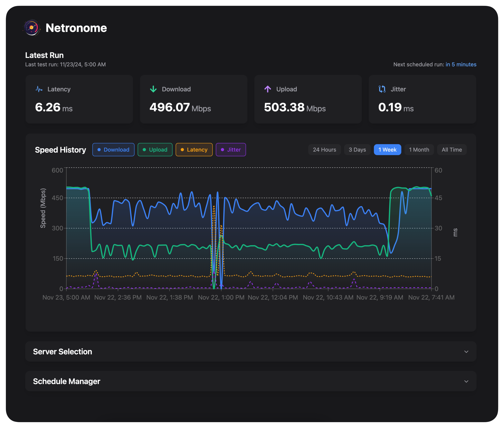

<h1 align="center">Netronome</h1>

<p align="center">
  
</p>

Netronome (Network Metronome) is a modern network speed testing and monitoring tool with a clean, intuitive web interface. It offers both scheduled and on-demand speed tests with detailed visualizations and historical tracking.

## ✨ Features

- **Speed Testing**

  - Support for both Speedtest.net and iPerf servers
  - Real-time test progress visualization
  - Detailed latency measurements

- **Monitoring**

  - Interactive historical data charts
  - Customizable time ranges (1d, 3d, 1w, 1m, all)

- **Scheduling & Automation**

  - Automated speed tests with flexible scheduling

- **Modern Interface**

  - Clean, responsive design
  - Dark mode optimized
  - Real-time updates
  - Interactive charts and visualizations

- **Flexible Authentication**
  - Built-in user authentication
  - OpenID Connect support

## 🚀 Getting Started

### Prerequisites

- Go 1.23 or later
- Node.js 22 or later
- pnpm package manager
- Docker (optional)
- Make (optional)
- PostgreSQL (optional)

### Quick Start

1. Clone the repository:

```bash
git clone https://github.com/autobrr/netronome.git
cd netronome
```

2. Install dependencies:

```bash
# Install frontend dependencies
cd web && pnpm install
cd ..

# Install Go dependencies
go mod download
```

3. Start the development environment:

```bash
make dev
```

### Docker Installation

For containerized deployment:

```bash
make docker-build
make docker-run
```

## 🛠️ Development Commands

- `make all` - Clean build frontend and backend
- `make build` - Build frontend and backend
- `make run` - Run the application
- `make dev` - Start development environment with live reload
- `make watch` - Live reload backend only
- `make clean` - Clean build artifacts

## ⚙️ Configuration

### Environment Variables

| Variable                         | Description                                                       | Default                                      | Required            |
| -------------------------------- | ----------------------------------------------------------------- | -------------------------------------------- | ------------------- |
| `NETRONOME_DB_TYPE`              | Database type (`sqlite`/`postgres`)                               | `sqlite`                                     | No                  |
| `NETRONOME_DB_PATH`              | SQLite database file path                                         | `./netronome.db`                             | Only for SQLite     |
| `NETRONOME_DB_HOST`              | PostgreSQL host                                                   | `localhost`                                  | Only for PostgreSQL |
| `NETRONOME_DB_PORT`              | PostgreSQL port                                                   | `5432`                                       | Only for PostgreSQL |
| `NETRONOME_DB_USER`              | PostgreSQL user                                                   | `postgres`                                   | Only for PostgreSQL |
| `NETRONOME_DB_PASSWORD`          | PostgreSQL password                                               | -                                            | Only for PostgreSQL |
| `NETRONOME_DB_NAME`              | PostgreSQL database name                                          | `netronome`                                  | Only for PostgreSQL |
| `NETRONOME_DB_SSLMODE`           | PostgreSQL SSL mode                                               | `disable`                                    | Only for PostgreSQL |
| `NETRONOME_IPERF_TEST_DURATION`  | Duration of iPerf tests in seconds                                | `10`                                         | No                  |
| `NETRONOME_IPERF_PARALLEL_CONNS` | Number of parallel iPerf connections                              | `4`                                          | No                  |
| `NETRONOME_LOG_LEVEL`            | Log level (`trace`/`debug`/`info`/`warn`/`error`/`fatal`/`panic`) | `info`                                       | No                  |
| `GIN_MODE`                       | Gin framework mode (`debug`/`release`)                            | `release`                                    | No                  |
| `OIDC_ISSUER`                    | OpenID Connect issuer URL                                         | -                                            | Only for OIDC       |
| `OIDC_CLIENT_ID`                 | OpenID Connect client ID                                          | -                                            | Only for OIDC       |
| `OIDC_CLIENT_SECRET`             | OpenID Connect client secret                                      | -                                            | Only for OIDC       |
| `OIDC_REDIRECT_URL`              | OpenID Connect redirect URL                                       | http://localhost:8080/api/auth/oidc/callback | Only for OIDC       |

### Database

Netronome supports two database backends:

1. **SQLite** (Default)

   - No additional setup required

2. **PostgreSQL**
   - Configure via:
     ```bash
     NETRONOME_DB_TYPE=postgres
     NETRONOME_DB_HOST=localhost
     NETRONOME_DB_PORT=5432
     NETRONOME_DB_USER=postgres
     NETRONOME_DB_PASSWORD=your-password
     NETRONOME_DB_NAME=netronome
     NETRONOME_DB_SSLMODE=disable
     ```

### Authentication

Netronome supports two authentication methods:

1. **Built-in Authentication**

   - Username/password authentication
   - Default option if no OIDC is configured

2. **OpenID Connect (OIDC)**
   - Integration with identity providers (Google, Okta, Auth0, Keycloak, Pocket-ID etc.)
   - Configure via environment variables:
     ```bash
     OIDC_ISSUER=https://pocketid.domain.net
     OIDC_CLIENT_ID=your-client-id
     OIDC_CLIENT_SECRET=your-client-secret
     OIDC_REDIRECT_URL=https://netronome.domain.net/api/auth/oidc/callback
     ```

## 🤝 Contributing

We welcome contributions! Please follow these steps:

1. Fork the repository
2. Create your feature branch (`git checkout -b feature/amazing-feature`)
3. Commit your changes (`git commit -m 'feat: add amazing feature'`)
4. Push to the branch (`git push origin feature/amazing-feature`)
5. Open a Pull Request

## 📝 License

This project is licensed under the GNU General Public License v2.0 - see the [LICENSE](LICENSE) file for details.
