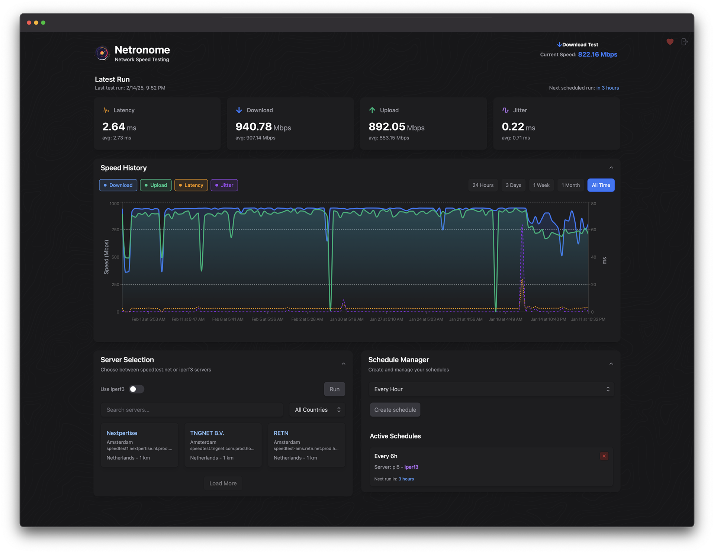

<h1 align="center">Netronome</h1>
<p align="center">
  Network speed tests and server monitoring.
</p>
<p align="center">
  
  <a href="https://netrono.me"></a>
  <a href="https://discord.gg/WehFCZxq5B"></a>
</p>

<p align="center">
  
</p>

Netronome tests your network speed with Speedtest.net, iperf3, or LibreSpeed. It also traces routes and watches packet loss and DNS resolvers. Agents on your servers send it system and bandwidth data. When a value goes past a limit, you get a notification. One binary holds the server, the web interface, and the agent.

## Documentation

The documentation is at [netrono.me](https://netrono.me):

- [Installation](https://netrono.me/getting-started/installation/)
- [Configuration file](https://netrono.me/reference/configuration-file/)
- [Agents](https://netrono.me/monitoring/agents/)
- [FAQ and troubleshooting](https://netrono.me/help/faq/)

The source of the documentation is in [`documentation/`](documentation/).

## Quick start

With Docker:

```bash
git clone https://github.com/autobrr/netronome.git
cd netronome
docker compose -f distrib/docker/docker-compose.yml run --rm --user root --entrypoint chown netronome netronome:netronome /data
docker compose -f distrib/docker/docker-compose.yml run --rm netronome generate-config
docker compose -f distrib/docker/docker-compose.yml up -d
```

Then open `http://localhost:7575` and create your user. For the binary and other platforms, see [Installation](https://netrono.me/getting-started/installation/).

## Contributing

Read [CONTRIBUTING.md](.github/CONTRIBUTING.md) before you open an issue or a pull request.

## License

GNU General Public License v2.0. See [LICENSE](LICENSE).
